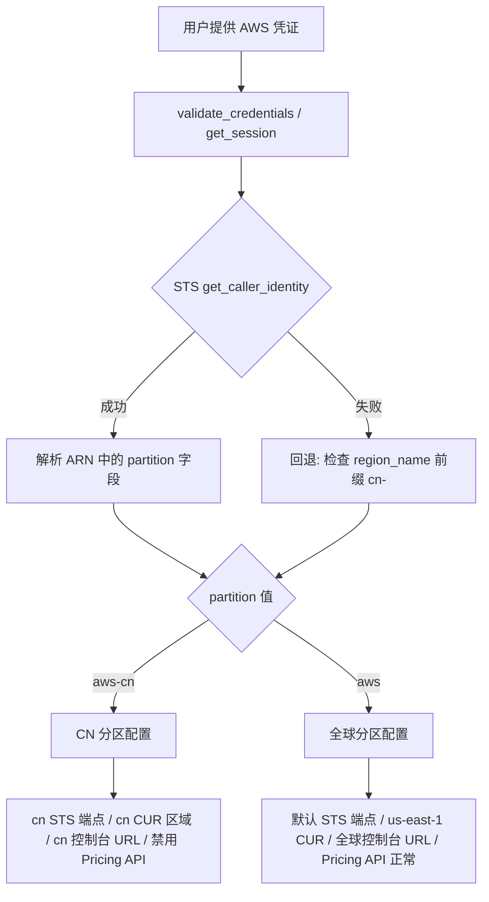

# 设计文档：AWS CN（中国区）支持

## 概述

本设计旨在使 OptScale 的 AWS 适配器（`Aws` 类）完整支持 AWS 中国区（`aws-cn` 分区）。当前代码中存在多处硬编码值（如 `us-east-1`、`https://console.aws.amazon.com`、`arn:aws` 等），仅适用于 AWS 全球分区。本设计通过引入分区检测机制和条件化配置，使同一个 `Aws` 类能够同时支持全球分区和中国分区。

核心设计原则：
- 最小化代码改动，不引入新的子类或工厂模式变更
- 通过分区检测结果驱动所有分区相关的配置选择
- 保持向后兼容，全球分区的行为不受影响
- 用户无需手动指定分区，系统自动检测

## 架构

### 整体方案

在 `Aws` 类中新增一个 `partition` 属性（懒加载），通过 STS `get_caller_identity` 返回的 ARN 自动检测分区。所有依赖分区的硬编码值通过辅助属性/方法根据 `partition` 动态返回正确的值。



### 分区配置映射

```python
PARTITION_CONFIG = {
    'aws': {
        'arn_prefix': 'arn:aws',
        'sts_endpoint': 'https://sts.amazonaws.com',
        'sts_region': 'us-east-1',
        'cur_region': 'us-east-1',
        'console_url': 'https://console.aws.amazon.com',
        'ec2_region': 'us-east-1',       # 用于 describe_regions
        'default_s3_region': 'eu-central-1',
        'ssm_region': 'us-east-1',
        'pricing_available': True,
    },
    'aws-cn': {
        'arn_prefix': 'arn:aws-cn',
        'sts_endpoint_template': 'https://sts.{region}.amazonaws.com.cn',
        'sts_region': 'cn-north-1',
        'cur_region': 'cn-northwest-1',
        'console_url': 'https://console.amazonaws.cn',
        'ec2_region': 'cn-north-1',       # 用于 describe_regions
        'default_s3_region': 'cn-northwest-1',
        'ssm_region': 'cn-north-1',
        'pricing_available': False,
    },
}
```

### 影响范围

不需要修改工厂（`cloud.py`）、枚举（`enums.py`）或基类（`base.py`）。所有改动集中在 `aws.py` 文件中。

## 组件与接口

### 1. 分区检测（`partition` 属性）

新增懒加载属性 `partition`，返回 `'aws'` 或 `'aws-cn'`。

```python
@property
def partition(self):
    if not hasattr(self, '_partition') or self._partition is None:
        self._partition = self._detect_partition()
    return self._partition

def _detect_partition(self):
    """通过 STS ARN 检测分区，失败时回退到 region_name 前缀判断"""
    try:
        sts = self._base_session().client('sts', config=IAM_CLIENT_CONFIG)
        identity = sts.get_caller_identity()
        arn = identity.get('Arn', '')
        # ARN 格式: arn:{partition}:sts::{account}:...
        parts = arn.split(':')
        if len(parts) >= 2:
            return parts[1]  # 'aws' 或 'aws-cn'
    except Exception:
        pass
    # 回退: 基于 region_name 前缀判断
    region = self.config.get('region_name', '')
    if region.startswith('cn-'):
        return 'aws-cn'
    return 'aws'
```

### 2. 分区感知辅助属性

以下属性根据 `partition` 返回正确的值：

```python
@property
def _is_cn_partition(self):
    return self.partition == 'aws-cn'

@property
def _console_base_url(self):
    return PARTITION_CONFIG[self.partition]['console_url']

@property
def _cur_region(self):
    return PARTITION_CONFIG[self.partition]['cur_region']

@property  
def _ec2_default_region(self):
    return PARTITION_CONFIG[self.partition]['ec2_region']

@property
def _arn_prefix(self):
    return PARTITION_CONFIG[self.partition]['arn_prefix']

@property
def _pricing_available(self):
    return PARTITION_CONFIG[self.partition]['pricing_available']
```

### 3. 受影响的方法改动

| 方法/属性 | 当前硬编码 | 改动方式 |
|---|---|---|
| `get_session` (AssumeRole) | `arn:aws:iam::` | 使用 `self._arn_prefix` |
| `_sts_global` | `DEFAULT_STS_REGION_NAME`, `DEFAULT_STS_ENDPOINT_URL` | 根据分区选择端点 |
| `cur` | `'us-east-1'` | 使用 `self._cur_region` |
| `pricing` | `'us-east-1'` | CN 分区返回 `None` 或抛异常 |
| `_generate_cloud_link` | `DEFAULT_BASE_URL` | 使用 `self._console_base_url` |
| `allowed_regions` | `'us-east-1'` | 使用 `self._ec2_default_region` |
| `ssm` | `'us-east-1'` | 使用分区对应区域 |
| `get_region_name_code_map` | SSM 路径 | CN 分区回退到静态映射 |
| `get_pricing` 等 6 个方法 | 直接调用 Pricing API | CN 分区返回空或抛异常 |
| `validate_credentials` | 使用默认 STS | 使用分区感知 STS |

### 4. `_generate_cloud_link` 改动

当前是 `@staticmethod`，需要改为实例方法以访问 `self._console_base_url`：

```python
def _generate_cloud_link(self, resource_type, region, resource_value):
    base_url = self._console_base_url
    cloud_link_map = {
        InstanceResource: CLOUD_LINK_PATTERN % (
            base_url, 'ec2', region, 'InstanceDetails:instanceId', resource_value),
        # ... 其他资源类型同理
    }
    return cloud_link_map.get(resource_type)
```

### 5. Pricing API 处理

新增异常类 `PricingNotAvailableException`：

```python
class PricingNotAvailableException(CloudAdapterBaseException):
    pass
```

CN 分区下的 pricing 相关方法处理：

```python
@property
def pricing(self):
    if self._is_cn_partition:
        return None
    return self.session.client('pricing', 'us-east-1')

def get_pricing(self, filters):
    if self._is_cn_partition:
        return []
    # ... 原有逻辑

def get_similar_sku_prices(self, sku):
    if self._is_cn_partition:
        return []
    # ... 原有逻辑

def get_prices(self, filters):
    if self._is_cn_partition:
        return []
    # ... 原有逻辑

def get_pricing_score_base(self, regions, skus):
    if self._is_cn_partition:
        return {r: 0 for r in regions}
    # ... 原有逻辑

def get_oregon_sku_for_types(self, instance_types):
    if self._is_cn_partition:
        return []
    # ... 原有逻辑

def get_price_checking_skus(self):
    if self._is_cn_partition:
        return []
    # ... 原有逻辑
```

### 6. SSM 区域名称映射回退

```python
def get_region_name_code_map(self):
    if self._is_cn_partition:
        # CN 分区 SSM 不支持 global-infrastructure 参数，使用静态映射
        coords = self._get_coordinates_map()
        return {v['name']: k for k, v in coords.items()
                if k.startswith('cn-')}
    # ... 原有 SSM 逻辑
```

## 数据模型

### 配置字典（`cloud_config`）

现有配置字段无需变更，以下字段已存在并继续支持：

```python
{
    'access_key_id': str,        # AWS Access Key
    'secret_access_key': str,    # AWS Secret Key
    'region_name': str,          # 可选，用户指定区域
    'sts_endpoint_url': str,     # 可选，覆盖 STS 端点
    'sts_region_name': str,      # 可选，覆盖 STS 区域
    'assume_role_account_id': str,  # 可选，AssumeRole 账户 ID
    'assume_role_name': str,     # 可选，AssumeRole 角色名
    # ... 其他现有字段
}
```

### 分区配置常量

新增模块级常量 `PARTITION_CONFIG`（字典），键为分区名（`'aws'`、`'aws-cn'`），值为该分区的配置参数字典。

### 新增异常类

在 `tools/cloud_adapter/exceptions.py` 中新增：

```python
class PricingNotAvailableException(CloudAdapterBaseException):
    pass
```

### 内部状态

`Aws` 实例新增内部属性：
- `_partition`: 缓存的分区检测结果（`'aws'` 或 `'aws-cn'`）


## 正确性属性（Correctness Properties）

*属性（Property）是指在系统所有有效执行中都应成立的特征或行为——本质上是对系统应做什么的形式化陈述。属性是人类可读规范与机器可验证正确性保证之间的桥梁。*

### Property 1: ARN 分区检测

*For any* 有效的 AWS ARN 字符串（格式为 `arn:{partition}:...`），分区检测函数应正确提取分区字段：包含 `aws-cn` 的 ARN 应返回 `'aws-cn'`，包含 `aws` 的 ARN 应返回 `'aws'`。

**Validates: Requirements 1.1, 1.2, 1.3**

### Property 2: 基于区域名称的回退分区检测

*For any* 区域名称字符串，当 STS 调用失败时，以 `cn-` 开头的区域名称应使分区检测返回 `'aws-cn'`，其他区域名称应返回 `'aws'`。

**Validates: Requirements 1.4**

### Property 3: AssumeRole ARN 动态构建

*For any* 分区（`'aws'` 或 `'aws-cn'`）、任意账户 ID 和角色名称，构建的 RoleArn 应以该分区对应的 ARN 前缀开头（`arn:aws:iam::` 或 `arn:aws-cn:iam::`），并包含正确的账户 ID 和角色名称。

**Validates: Requirements 2.1**

### Property 4: 分区配置映射一致性

*For any* 分区值（`'aws'` 或 `'aws-cn'`），从 `PARTITION_CONFIG` 查询得到的 STS 端点、STS 区域、CUR 区域、EC2 默认区域和默认 S3 区域应与该分区的预期值完全匹配。具体而言：`'aws'` 分区的 CUR 区域为 `'us-east-1'`，`'aws-cn'` 分区的 CUR 区域为 `'cn-northwest-1'`；`'aws'` 分区的默认 S3 区域为 `'eu-central-1'`，`'aws-cn'` 分区的默认 S3 区域为 `'cn-northwest-1'`；以此类推。

**Validates: Requirements 3.1, 3.2, 4.1, 4.2, 7.1, 7.2, 9.1, 9.2**

### Property 5: CN 分区定价方法返回空结果

*For any* CN 分区的 Adapter 实例，调用 `get_pricing`、`get_similar_sku_prices`、`get_prices`、`get_pricing_score_base`、`get_oregon_sku_for_types` 和 `get_price_checking_skus` 方法时，应返回空列表或空字典，而不应尝试创建 pricing 客户端或调用 Pricing API。

**Validates: Requirements 5.1, 5.2, 5.4**

### Property 6: 分区感知控制台链接

*For any* 分区和任意支持的资源类型（Instance、Volume、Snapshot、Bucket、IpAddress、LoadBalancer），`_generate_cloud_link` 生成的 URL 应以该分区对应的控制台基础 URL 开头：`'aws'` 分区使用 `https://console.aws.amazon.com`，`'aws-cn'` 分区使用 `https://console.amazonaws.cn`。

**Validates: Requirements 6.1, 6.2, 6.4**

### Property 7: CN 分区 SSM 回退到静态映射

*For any* CN 分区的 Adapter 实例，`get_region_name_code_map` 返回的映射应仅包含以 `cn-` 开头的区域代码，且每个区域代码都应存在于 `_get_coordinates_map` 中。

**Validates: Requirements 8.2**

### Property 8: 无效区域名称验证

*For any* 不在 `_get_coordinates_map` 返回的字典中的区域名称字符串，`validate_credentials` 方法应抛出 `InvalidParameterException` 异常。

**Validates: Requirements 10.3**

## 错误处理

### 分区检测失败

- STS `get_caller_identity` 调用失败（网络错误、凭证无效等）时，回退到基于 `region_name` 前缀的判断
- 如果 `region_name` 也未提供，默认为全球分区（`'aws'`），保持向后兼容

### Pricing API 不可用

- CN 分区下所有 pricing 相关方法返回空结果（空列表/空字典）
- `pricing` 属性在 CN 分区下返回 `None`
- 调用方需要处理空结果的情况（现有调用方已有空结果处理逻辑）

### SSM 参数路径不可用

- CN 分区下 `get_region_name_code_map` 直接使用静态映射，不尝试调用 SSM
- 静态映射从 `_get_coordinates_map` 中过滤 `cn-` 前缀的区域

### 无效区域名称

- `validate_credentials` 在检测到无效区域名称时抛出 `InvalidParameterException`
- 错误信息包含具体的无效区域名称

### AssumeRole 失败

- CN 分区下 AssumeRole 使用正确的 ARN 前缀和 STS 端点
- 如果 AssumeRole 失败，现有的异常处理机制（`ClientError` 捕获）继续生效

## 测试策略

### 双重测试方法

本特性采用单元测试和属性测试相结合的方式：

- **单元测试**：验证具体示例、边界情况和错误条件
- **属性测试**：验证跨所有输入的通用属性

### 属性测试配置

- 使用 **Hypothesis** 库进行属性测试（Python 生态中最成熟的 PBT 库）
- 每个属性测试至少运行 **100 次迭代**
- 每个属性测试通过注释引用设计文档中的属性编号
- 标签格式：**Feature: aws-cn-support, Property {number}: {property_text}**
- 每个正确性属性由**单个**属性测试实现

### 单元测试范围

- 分区检测的具体 ARN 示例（`arn:aws:iam::123456:root`、`arn:aws-cn:iam::123456:root`）
- STS 端点 URL 的用户配置覆盖（`sts_endpoint_url` 优先级）
- `region_name` 用户配置覆盖（优先级测试）
- Pricing API 在 CN 分区下的各方法返回值
- `_generate_cloud_link` 对各资源类型的 URL 生成
- `get_region_name_code_map` 在 CN 分区下的回退行为

### 属性测试范围

对应设计文档中的 8 个正确性属性：

1. **Property 1**: 生成随机有效 ARN，验证分区提取正确性
2. **Property 2**: 生成随机区域名称（含 `cn-` 前缀和非 `cn-` 前缀），验证回退逻辑
3. **Property 3**: 生成随机分区、账户 ID、角色名称，验证 ARN 构建格式
4. **Property 4**: 遍历所有分区值，验证配置映射的完整性和正确性
5. **Property 5**: 在 CN 分区下调用所有 pricing 方法，验证返回空结果
6. **Property 6**: 生成随机分区和资源类型，验证控制台 URL 前缀
7. **Property 7**: 验证 CN 分区 SSM 回退映射仅包含 CN 区域
8. **Property 8**: 生成不在 coordinates_map 中的随机字符串，验证异常抛出

### 测试文件组织

```
tools/cloud_adapter/tests/
├── test_aws_cn_partition.py          # 单元测试
└── test_aws_cn_partition_props.py    # 属性测试（Hypothesis）
```
